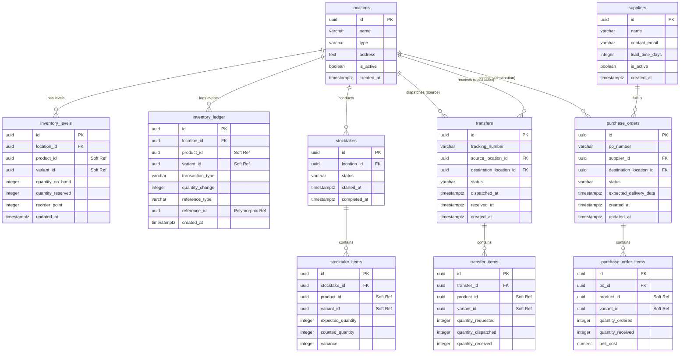

```mermaid
erDiagram
    %% Relationships
    locations ||--o{ inventory_levels : "has levels"
    locations ||--o{ inventory_ledger : "logs events"
    locations ||--o{ purchase_orders : "receives (destination)"
    locations ||--o{ transfers : "dispatches (source)"
    locations ||--o{ transfers : "receives (destination)"
    locations ||--o{ stocktakes : "conducts"
    
    suppliers ||--o{ purchase_orders : "fulfills"
    purchase_orders ||--o{ purchase_order_items : "contains"
    
    transfers ||--o{ transfer_items : "contains"
    
    stocktakes ||--o{ stocktake_items : "contains"

    %% Tables
    locations {
        uuid id PK
        varchar name
        varchar type
        text address
        boolean is_active
        timestamptz created_at
    }

    inventory_levels {
        uuid id PK
        uuid location_id FK
        uuid product_id "Soft Ref"
        uuid variant_id "Soft Ref"
        integer quantity_on_hand
        integer quantity_reserved
        integer reorder_point
        timestamptz updated_at
    }

    inventory_ledger {
        uuid id PK
        uuid location_id FK
        uuid product_id "Soft Ref"
        uuid variant_id "Soft Ref"
        varchar transaction_type
        integer quantity_change
        varchar reference_type
        uuid reference_id "Polymorphic Ref"
        timestamptz created_at
    }

    suppliers {
        uuid id PK
        varchar name
        varchar contact_email
        integer lead_time_days
        boolean is_active
        timestamptz created_at
    }

    purchase_orders {
        uuid id PK
        varchar po_number
        uuid supplier_id FK
        uuid destination_location_id FK
        varchar status
        timestamptz expected_delivery_date
        timestamptz created_at
        timestamptz updated_at
    }

    purchase_order_items {
        uuid id PK
        uuid po_id FK
        uuid product_id "Soft Ref"
        uuid variant_id "Soft Ref"
        integer quantity_ordered
        integer quantity_received
        numeric unit_cost
    }

    transfers {
        uuid id PK
        varchar tracking_number
        uuid source_location_id FK
        uuid destination_location_id FK
        varchar status
        timestamptz dispatched_at
        timestamptz received_at
        timestamptz created_at
    }

    transfer_items {
        uuid id PK
        uuid transfer_id FK
        uuid product_id "Soft Ref"
        uuid variant_id "Soft Ref"
        integer quantity_requested
        integer quantity_dispatched
        integer quantity_received
    }

    stocktakes {
        uuid id PK
        uuid location_id FK
        varchar status
        timestamptz started_at
        timestamptz completed_at
    }

    stocktake_items {
        uuid id PK
        uuid stocktake_id FK
        uuid product_id "Soft Ref"
        uuid variant_id "Soft Ref"
        integer expected_quantity
        integer counted_quantity
        integer variance
    }
```
