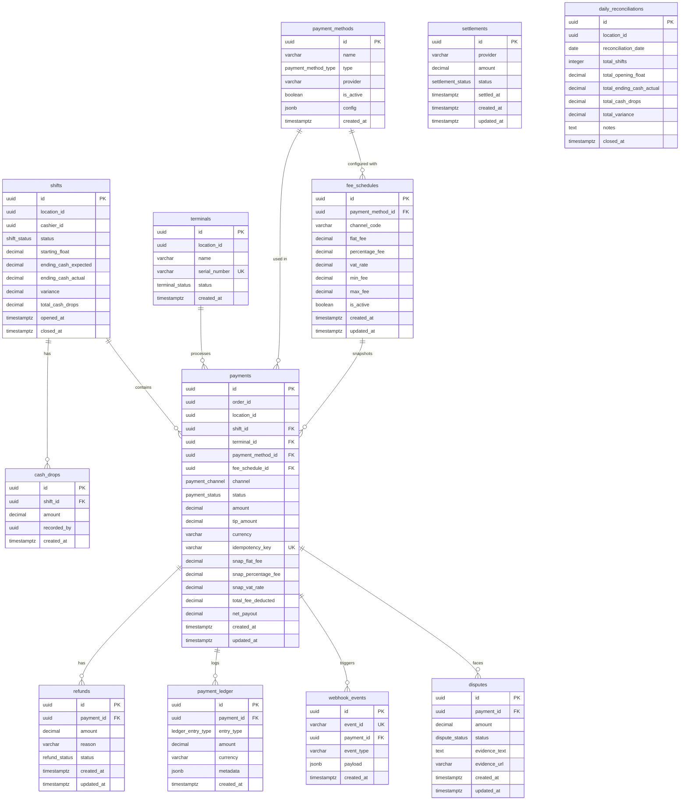

# Fintech Ledger

## Preliminary

Fintech Ledger is a standalone backend service responsible for managing the financial ledger of my POS ecosystem. It is designed as one of several microservices within a larger monorepo architecture, with a focus on reliability, consistency, and auditability.

The service integrates with Xendit to process multiple payment methods, including:

### Xendit Supported Channels Checklist

| Category | Channel / Provider | Description | Status |
| --- | --- | --- | --- |
| **Cash (Retail Outlets)** |
|  | In-Store | Over-the-counter OTC payment | [x] |
| **E-Wallets** | **OVO** |  | [x] |
|  | **DANA** |  | [-] |
|  | **ShopeePay** |  | [-] |
|  | **LinkAja** |  | [-] |
|  | **AstraPay** |  | [-] |
|  | **Jenius Pay** |  | [-] |
|  | **Sakuku** |  | [-] |
| **Credit Cards** | **Visa** |  | [-] |
|  | **Mastercard** |  | [-] |
| **Debit Cards** | **Online Debit** |  | [-] |
|  | **Direct Debit (BCA OneKlik)** |  | [-] |
|  | **Direct Debit (BRI)** |  | [-] |
| **QRIS** | **Dynamic QRIS** | Auto-generated per transaction | [-] |
|  | **Static QRIS** | Fixed reusable QR code | [-] |

## Core Principles

The project is built around modern ledger and financial system design principles, including:

- [x] ACID-compliant atomic transaction
- [-] Tamper-evident hash chains (need to connect)
- [-] Idempotency protection for payment requests (need to connect 
- [-] PII scrubbing for sensitive data (need to connect
- [x] Global error handling
- [x] Transaction reconciliation
- [x] Audit logging
- [x] Secure webhook verification
- [x] Double-entry bookkeeping

## Tech Stack

- **Runtime:** Node.js
- **Framework:** NestJS
- **Language:** TypeScript
- **Database:** PostgreSQL
- **Query builder:** Kysely
- **Docs:** Swagger

## Installation

```bash
# On root directory
pnpm install
pnpm run migrate
pnpm run dev
```

Seeding:

```bash
pnpm run db:seed
```

Reset database:

```bash
pnpm run db:reset
```

Start fresh database:

```bash
pnpm run db:fresh
```

Health check:

```bash
curl http://localhost:8080/api/health
```

## ER Diagram



## Key Architecture
TBA

## API Endpoints Reference

### 0. System Health & Core

| Method | Endpoint | Description |
| --- | --- | --- |
| `GET` | `/api/health` | System health and connectivity status check |
| `GET` | `/api/docs` | API Documentation |

---

## 1. Phase 1: Payment Core & Configuration Foundation

### Payment Methods

| Method | Endpoint | Description |
| --- | --- | --- |
| `GET` | `/api/payment-methods` | List configured payment methods |
| `POST` | `/api/payment-methods` | Create a new payment method configuration |
| `GET` | `/api/payment-methods/:id` | Get single payment method details |
| `PATCH` | `/api/payment-methods/:id` | Update payment method configuration or status (`is_active: false`) |

### Payments & Transactions (Core Engine)

| Method | Endpoint | Description |
| --- | --- | --- |
| `POST` | `/api/payments` | Create a payment attempt against an `orderId` (`channel`: `IN_PERSON` | `ONLINE`, requires/infers `shiftId` for `IN_PERSON`) |
| `GET` | `/api/payments` | List payment attempts across all orders |
| `GET` | `/api/payments/:id` | Get payment attempt details |
| `PATCH` | `/api/payments/:id` | Edit amount/method for `PENDING` payments prior to capture |
| `DELETE` | `/api/payments/:id` | Cancel an uncaptured, un-attempted payment record |
| `GET` | `/api/orders/:orderId/payments` | Get all payment attempts linked to a specific order |

---

## 2. Phase 2: In-Person (POS), Terminals & Shift Operations

### Shift & Cash Drawer Operations

| Method | Endpoint | Description |
| --- | --- | --- |
| `POST` | `/api/shifts/open` | Open shift and declare starting cash float in drawer |
| `GET` | `/api/shifts` | List shifts (filterable by `locationId`, `cashierId`, date range, `status`) |
| `GET` | `/api/shifts/:id` | Get detailed shift summary (opening float, running totals, cash drops, linked payments) |
| `GET` | `/api/locations/:id/shifts` | Shift history for a specific location |
| `POST` | `/api/shifts/cash-drop` | Record mid-shift cash drop (moving excess cash from drawer to safe) |
| `POST` | `/api/shifts/close` | Close shift, record ending cash drawer count, and calculate variance |
| `POST` | `/api/shifts/:id/force-close` | Manager/Admin override to force-close an abandoned shift and flag for audit |

### Capture (In-Person)

| Method | Endpoint | Description |
| --- | --- | --- |
| `POST` | `/api/payments/:id/capture-cash` | Complete and record a cash payment capture |
| `POST` | `/api/payments/:id/capture-card-present` | Initiate/complete card-present hardware capture |
| `POST` | `/api/payments/:id/cancel` | Void payment attempt prior to capture completion |
| `POST` | `/api/payments/:id/reverse` | Reverse a captured in-person payment (same-day window void) |

### Terminals / Devices

| Method | Endpoint | Description |
| --- | --- | --- |
| `GET` | `/api/terminals` | List registered card readers per location |
| `POST` | `/api/terminals` | Register a new card terminal |
| `GET` | `/api/terminals/:id` | Get details of a single terminal |
| `PATCH` | `/api/terminals/:id` | Update terminal details (rename, reassign location, update status) |
| `POST` | `/api/terminals/:id/ping` | Terminal connectivity and health check |

### Split Tender & Multi-Method

| Method | Endpoint | Description |
| --- | --- | --- |
| `POST` | `/api/orders/:orderId/payments/split` | Atomically orchestrate multiple captures (part cash, part card) using internal core capture pipelines |
| `GET` | `/api/orders/:orderId/payments/balance` | Calculate remaining unpaid balance on an order |

---

## 3. Phase 3: Tips, Receipts, & Post-Processing

### Tips / Gratuity

| Method | Endpoint | Description |
| --- | --- | --- |
| `PATCH` | `/api/payments/:id/tip` | Attach or adjust a tip amount post-capture |
| `GET` | `/api/locations/:id/reports/tips` | Get tip totals filtered by location and date range |

### Receipts

| Method | Endpoint | Description |
| --- | --- | --- |
| `GET` | `/api/payments/:id/receipt` | Retrieve formatted receipt payload (JSON or print-ready) |
| `POST` | `/api/payments/:id/receipt/resend` | Email or SMS receipt copy to customer |

### Refunds

| Method | Endpoint | Description |
| --- | --- | --- |
| `POST` | `/api/payments/:id/refunds` | Issue a refund against a captured payment |
| `GET` | `/api/payments/:id/refunds` | List all refunds issued for a specific payment |
| `GET` | `/api/refunds` | List all refunds system-wide |
| `GET` | `/api/refunds/:id` | Get single refund details |
| `PATCH` | `/api/refunds/:id/status` | Update async refund status (card-present terminal processing) |

---

## 4. Phase 4: Online Gateway & Asynchronous Processing

### Online Checkout Gateway

| Method | Endpoint | Description |
| --- | --- | --- |
| `POST` | `/api/payments/:id/create-checkout-session` | Initialize online hosted checkout session |
| `GET` | `/api/payments/:id/checkout-session` | Get checkout session status and payload |
| `POST` | `/api/payments/:id/retry` | Retry a failed online checkout session |
| `POST` | `/api/payments/:id/cancel-checkout-session` | Cancel an active online checkout session |
| `GET` | `/api/gateway-config` | Get active gateway providers and public keys (SuperAdmin) |
| `PATCH` | `/api/gateway-config` | Configure/enable gateway provider settings (SuperAdmin) |

### Webhooks

| Method | Endpoint | Description |
| --- | --- | --- |
| `POST` | `/api/webhooks/gateway` | Inbound payment gateway webhook handler stub |
| `GET` | `/api/webhooks/events` | Internal audit log of received webhooks (debugging/deduplication) |
| `GET` | `/api/webhooks/events/:id` | Get details of a specific received webhook event |

### Disputes & Chargebacks

| Method | Endpoint | Description |
| --- | --- | --- |
| `GET` | `/api/disputes` | List all chargebacks and disputes |
| `GET` | `/api/disputes/:id` | Get dispute details |
| `POST` | `/api/disputes/:id/respond` | Submit evidence response for a dispute |
| `PATCH` | `/api/disputes/:id/status` | Update internal dispute lifecycle status |

---

## 5. Phase 5: Ledger, Reconciliation, & Financial Reporting

### Reconciliation & Ledger

| Method | Endpoint | Description |
| --- | --- | --- |
| `GET` | `/api/payments/ledger` | List immutable transaction ledger records |
| `GET` | `/api/payments/ledger/:id` | Get single ledger entry details |
| `GET` | `/api/locations/:id/reconciliation/daily` | Fetch daily shift reconciliation breakdown against shift records |
| `GET` | `/api/reconciliation/discrepancies` | List cash drawer/terminal variance discrepancies |
| `POST` | `/api/locations/:id/reconciliation/close` | Lock and close shift/day financial reconciliation |

### Settlement & Payouts

| Method | Endpoint | Description |
| --- | --- | --- |
| `GET` | `/api/settlements` | List processor bank payouts/settlements |
| `GET` | `/api/settlements/:id` | Get settlement details |
| `POST` | `/api/settlements/:id/mark-paid` | Mark settlement reconciled in bank account |

### Fees & Multi-Currency

| Method | Endpoint | Description |
| --- | --- | --- |
| `GET` | `/api/fee-schedules` | List processor fee schedules by method |
| `POST` | `/api/fee-schedules` | Create a new fee schedule |
| `PATCH` | `/api/fee-schedules/:id` | Update fee schedule rates |
| `GET` | `/api/payments/:id/fees` | Get detailed fee breakdown for net-revenue calculation |
| `GET` | `/api/currencies` | List supported system currencies |
| `GET` | `/api/exchange-rates` | Fetch real-time exchange rates |

### Financial Reporting

| Method | Endpoint | Description |
| --- | --- | --- |
| `GET` | `/api/locations/:id/reports/payment-methods-breakdown` | Breakdown of sales by payment method per location |
| `GET` | `/api/locations/:id/reports/failed-payments` | Report of failed payment attempts per location |
| `GET` | `/api/reports/revenue/company-wide` | Consolidated company-wide revenue reporting |
